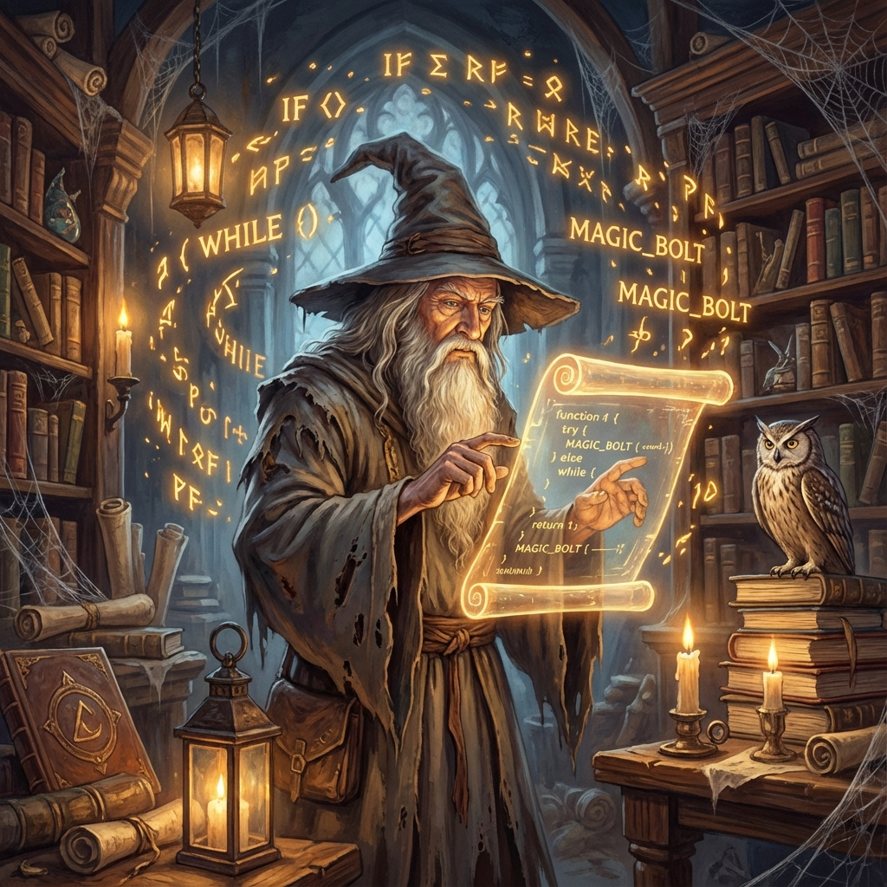

  

  

  

<h1 align="center">🧙‍♂️ Hello, I'm Sazzad Hossain 🧙‍♂️</h1>
<h3 align="center">The Full-Stack Wizard from Bangladesh 🇧🇩</h3>

  
  
    

---

## 📜 about_me.md

> *"It does not do to dwell on dreams and forget to live, but it does do to dream of better code."*

I am a **Full-Stack Web Developer** specializing in building modern, scalable web applications. Like a wizard mastering spells, I craft clean code and functional solutions for businesses and individual clients. My wand (keyboard) weaves magic with **React, Node.js, and MongoDB**.

- 🔭 I’m currently working on **Advanced MERN Stack Applications**
- 🌱 I’m currently learning **Next.js & Advanced System Design**
- ⚡ Fun fact: **I can center a div without using `display: flex` (sometimes)**

  

## 🧪 Potions & Spells (Tech Stack)

| **Class** | **Spells** |
|:---:|:---|
| **Frontend** |    |
| **Backend** |    |
| **Tools** |    |

  

## 🔮 Magical Services

I offer my services on **Fiverr** to Muggles and Wizards alike:
- 🌐 **Custom Web Applications**
- 🛠️ **MERN Stack Development**
- 📊 **Admin Dashboards & CRM**
- 🐞 **Bug Fixing & Optimization**

[**Hire Me on Fiverr**](https://www.fiverr.com/sazzadpiash)

  

## 📈 Wizarding Stats

  
  

 

  
   
  
<i>"Mischief Managed."</i>

